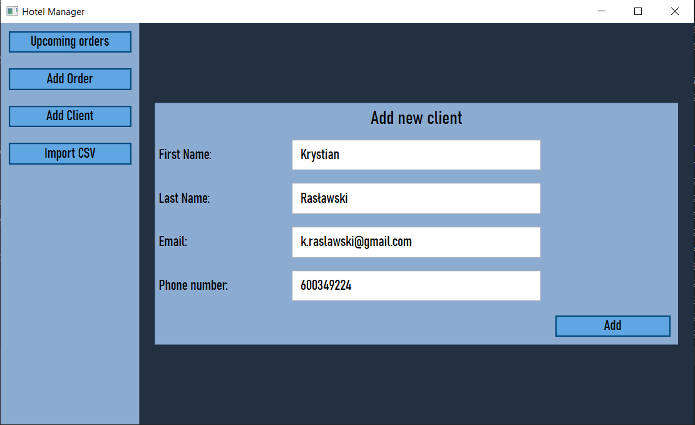
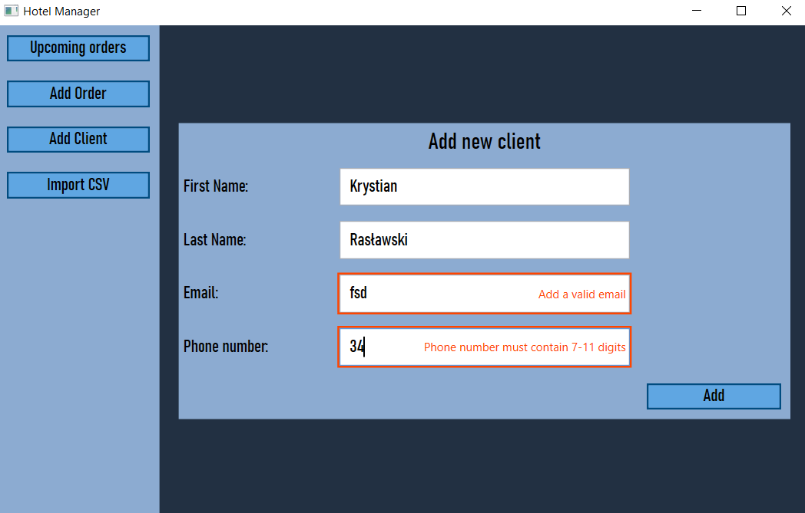
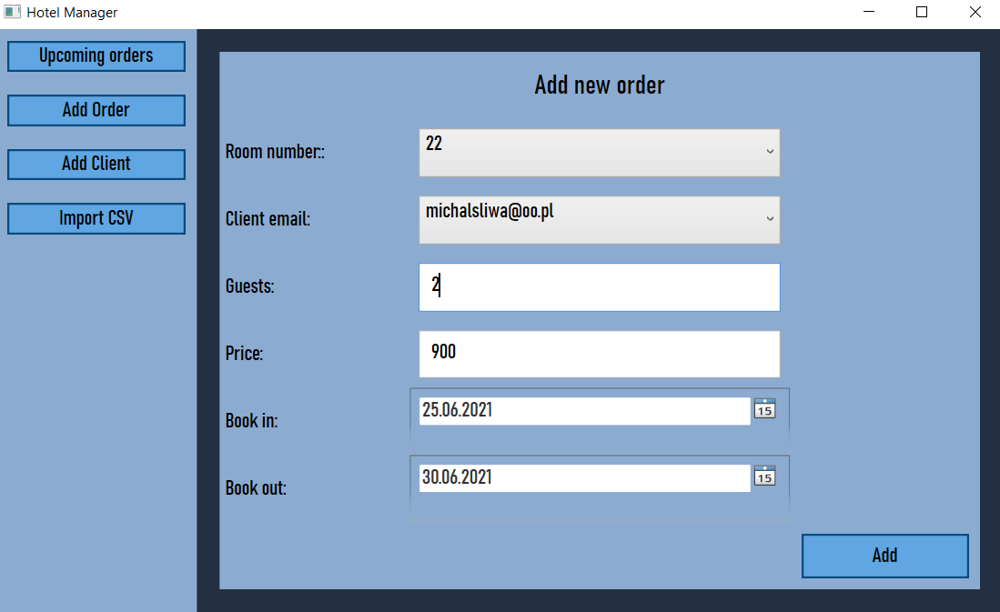
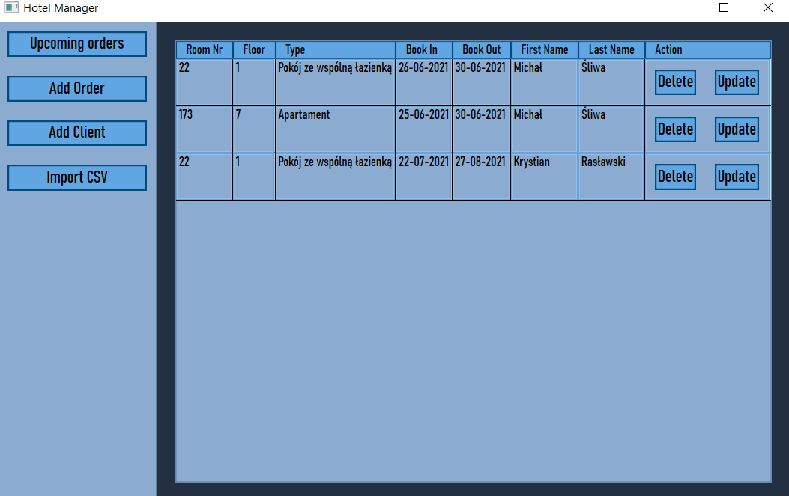
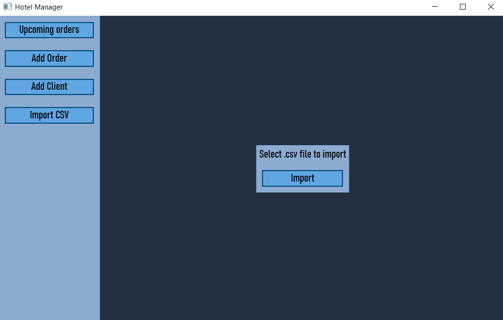

# Hotel Manager

## About
Desktop application made in WPF for booking room in hotel. Program was made as a job recruitment task in about 2 days.

## Technologies
- .NET Core 3.1
- WPF
- Entity Framework 3.1.6
- SQL Server


## Configuration
1. Insert your connection string in App.config.
```
<?xml version="1.0" encoding="utf-8" ?>
<configuration>
  <connectionStrings>
    <add name="HotelDatabase"
         connectionString="...HERE..." />
  </connectionStrings>
</configuration>
```

2. Create Migration

In Visual Studio in Package Manager Console execute command: 
```
add-migration MyFirstMigration
```
or if you are using dotnet Command Line Interface:
```
dotnet ef migrations add MyFirstMigration 
```

To create database shcema execute:

In Package Manager Console:
```
Update-Database 
```
In Command Line Interface:
```
dotnet ef database update 
```

## Screenshots

Add new client





Add new order



List orders



Import .csv (File must have same structure as rezerwacje.csv)


